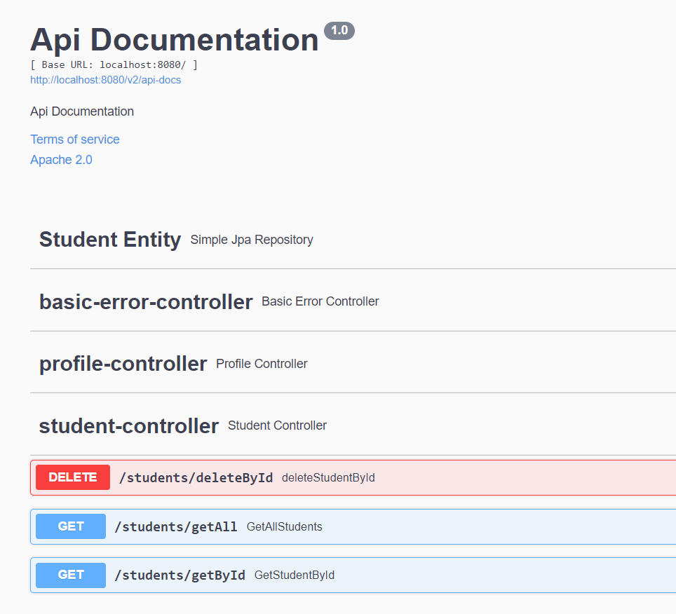

# Introduction
This is a project to help startup quickly a Springboot - angular project.
In my daily work, come to make new project of this kind all the time. So I made this to help myself to boot more quickly a 
project.

## Use case

You want to start a simple Springboot api project, with basic documentation then you can use this project and customize it at your with.
The project also includes some handy features like database management, angular startup et more that will come.

#Requirements
This is not a basic java project, if you want a cleaner and fresh springboot project, you can look at the [Springboot Initializer](https://start.spring.io/)

You need to install :

* npm 6.14
* Maven 3.5
* Docker
* JDK 17
* Angular 9

#Libraries used in the project

| Library                                               | Description                                                              | Version
| ---                                                   |---                                                                       |---                                                           
| Spring Framework                                      | The main framework for building api                                      | 5.3.10
| Hibernate                                             | An ORM to manage the database                                            | 5.4.32.final
| SpringFox                                             | Manage the api documentation                                             | 3.0.0
| Liquibase                                             | Manage the database migrations                                           | 4.3.5
| Postgresql                                            | A library to connect to the database                                     | 42.2.23
| Maven Compiler                                        | Used to build the project                                                | 3.8.1

# The sample project

A simple student management CRUD, where a student has 4 properties :

* FirstName
* LastName
* Age
* SchoolName

## Database
### Postgresql Instance
I have provided a ``postgresql 12.2`` image in ``docker-compose.yml``. 
Run the bellow command to start the database. you must have docker installed on your system.

````batch
docker-compose up
````

### Liquibase

Once started, you can check the liquibase file in ``/src/main/resources/db.changelog/20211011203800_add_student_table.xml``

````xml
<databaseChangeLog
        xmlns="http://www.liquibase.org/xml/ns/dbchangelog"
        xmlns:xsi="http://www.w3.org/2001/XMLSchema-instance"
   http://www.liquibase.org/xml/ns/dbchangelog
   http://www.liquibase.org/xml/ns/dbchangelog/dbchangelog-3.4.xsd">

    <changeSet author="cmedewou" id="20211011203800">

        <createTable tableName="student">
            <column autoIncrement="true" name="id" type="BIGINT">
                <constraints primaryKey="true" primaryKeyName="studentPK" />
            </column>
            <column name="version" type="numeric" />
            <column name="first_name" type="varchar" />
            <column name="last_name" type="varchar" />
            <column name="shcool_name" type="varchar" />
            <column name="age" type="numeric" />

        </createTable>
    </changeSet>

</databaseChangeLog>
````

You can see the created table and columns. the script will be run once you start the application.
If you want to add your table, add a new xml file, and reference it in the ``master.xml`` file.

You can check the liquibase documentation [here](https://www.liquibase.org/get-started/best-practices) to know how to write more complex script.


## The Api Generator

I created a script with the help of openapi-generator that will generate all the methods existing in your api controllers files into angular
services, so you won't do it yourself. This will speed up your development.

### The controller

in my StudentController.java file il have a method that return a student by id

````java
    @GetMapping("getById")
    public Student GetStudentById(Long id) {
        return studentRepository.findById(id).orElse(null);
    }
````

### run the api script

You can generate the api with the bellow command :

````batch
./services-api/generate.sh
````
Note that the application needs to be up before you run the command.

This will generate and install the api for you.
You can change the api name in ``/services-api/api.yml``

This will create a StudentControllerService.ts file in npm packages. 
You can just use the api with the code bellow with typescript


### Use the api
````java
this.service.getStudentByIdUsingGET(+route.paramMap.get('id'))
````

## Swagger UI

You can also visualize, test the api with the swagger ui.
Once you start the application, go to your [http://localhost:8080/swagger-ui](http://localhost:8080/swagger-ui/#/)



#Roadmap

- Dockerize all the application

#conclusion

I will be aupdating this project from time to time to integrate new versions of the libraires or new features that I use in my work.
Hope this helps you !!!


## Author
* **Cenyo Medewou** - [medewou@gmail.com](mailto:medewou@gmail.com).

